<table>
  <tr>
    <td valign="top"></td>
    <td valign="top"></td>
  </tr>
</table>

 

🍛 Currently building <a href="https://github.com/TheAnakin01/meal-planner"><b>meal-planner</b></a> — an allergen-safe weekly meal planner for Indian kitchens · <a href="https://meal-planner-pied-beta.vercel.app">try it live</a>

